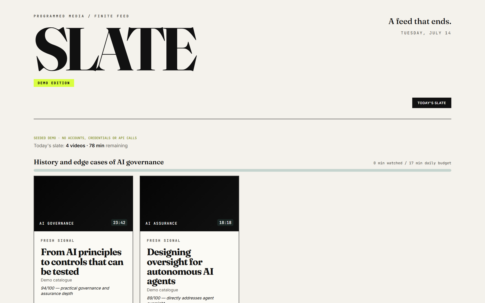

# Slate

A YouTube front end that shows you a finite, goal-aligned set of videos each day — and then ends.

[](LICENSE)

## Series context

Slate is the proof object for [*Your Information Diet and Your Feed*](https://substack.com/@henryflowers45/p-203171444) ([LinkedIn post](https://www.linkedin.com/posts/henry-flowers_insidethebox-davidepstein-ugcPost-7475247762431987712-n8qB/)), part of the *Looping in the Human* series.



Most feeds are built to never finish. Slate is built around the opposite idea — the **broadcast day**: a newspaper or an evening bulletin arrived at a set time, it was finite, and when you got through it, you were done. You tell Slate what you're trying to learn or follow, and twice a day it programs a short slate of videos that fit. When you've watched or cleared them, there is nothing left to scroll.

## How it works

- **Goals with a time budget** — each goal has a plain-language description and a weekly minute allowance; the description is what the relevance scorer reads
- **A blended candidate pool** — goal-driven searches plus uploads from channels you add, scored for fit with a light popularity signal
- **A feed that ends** — a hard cap per slate, a daily slice per goal, editions that unlock only at set times, and a sign-off screen instead of infinite scroll
- **Visible relevance** — each card shows which goal it matched and a one-line reason

## Run it

The app lives in [`slate/`](slate/). You'll need Node 18+ and two API keys—an **OpenAI key** (relevance scoring) and a **YouTube Data API v3 key** (candidate search). Supabase is optional, for caching.

```bash
cd slate
npm ci
cp .env.example .env.local
# Add OPENAI_API_KEY and YOUTUBE_API_KEY, then set SLATE_API_ENABLED=1.
vercel dev                     # runs the front end plus the serverless slate builder
```

`npm run dev` alone runs just the interface (no scoring). The slate builder runs server-side in `slate/api/build-slate.js`, so keys never reach the browser. Full setup — env vars, the optional Supabase cache schema, and quota notes — is in the [app README](slate/README.md).

## Deploy

Import the repo into Vercel (**set the project root directory to `slate/`**), add `OPENAI_API_KEY` and `YOUTUBE_API_KEY` under Environment Variables, and deploy. Editions only unlock at set times, so the refresh lock is only truly binding once it's running as a deployment. See [Deploying to Vercel](slate/README.md#deploying-to-vercel).

> No public demo is live right now. The API is disabled unless `SLATE_API_ENABLED=1`; Slate calls paid/quota-limited services, so it is meant to be self-hosted behind deployment protection or a durable edge rate limit rather than run as an open shared demo.

## License

[MIT](LICENSE)
